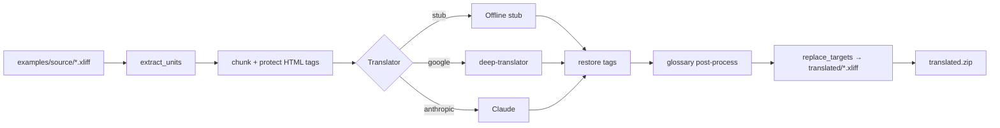

# xliff-translator

> Batch-translate WPML XLIFF exports with a pluggable backend, retry/backoff, chunked long strings, HTML-tag protection, and a JSON glossary post-processor.


[](https://github.com/gokhanagarer/xliff-translator/actions/workflows/test.yml)


## What it does

Drop a folder of WPML-exported `.xliff` files in and get a folder of translated files (plus a re-import-ready ZIP) out. Handles the parts WPML's machine translation gets wrong:

- **CDATA-safe rewrite** so embedded HTML tags survive the round-trip
- **Long-string chunking** that splits on paragraphs first, then sentences, so the source stays under the backend's character limit
- **HTML-tag protection** — tags are masked with `§TAGn§` placeholders before translation and restored after, so a backend that mangles HTML cannot break your output
- **Glossary post-processing** — case-insensitive, whole-word canonical replacements driven by a simple JSON file
- **Resume mode** — re-running only translates files that haven't been done yet

Originally built to translate a Turkish WordPress site to English without paying for a translation API. The plug-in `Translator` interface makes it trivial to swap backends — `stub` (offline), `google` (deep-translator free tier), or `anthropic` (Claude).

## Quickstart

```bash
git clone https://github.com/gokhanagarer/xliff-translator.git
cd xliff-translator
make demo
```

You'll get translated XLIFF files in `output/translated/` and a ZIP at `output/translated.zip` — produced by the offline stub backend, so no API keys are needed.

## Going live

```bash
cp .env.example .env
# pick a backend
echo "TRANSLATOR_BACKEND=google" >> .env  # or anthropic
echo "OFFLINE=0" >> .env
# (for anthropic) add ANTHROPIC_API_KEY

make install-dev
.venv/bin/python -m src.main \
  --source path/to/wpml-export \
  --output output/translated \
  --glossary examples/glossary.json
```

Resume an interrupted run with no flags; force a full re-translate with `--all`.

## Backends

| name | requires | notes |
|---|---|---|
| `stub` | nothing | offline placeholder — useful for CI and local checks |
| `google` | `deep-translator` | free Google Translate, no key, rate-limited |
| `anthropic` | `ANTHROPIC_API_KEY` | Claude — higher quality, paid |

## Glossary

Glossary is a flat JSON map of `{ "machine-translated term": "canonical replacement" }`. Matches are case-insensitive but whole-word, so `pos` will not match inside `position`. Example: `examples/glossary.json`.

## Architecture



## Configuration

| Env var | Required | Purpose |
|---|---|---|
| `OFFLINE` | always | `1` forces the stub backend regardless of `TRANSLATOR_BACKEND` |
| `TRANSLATOR_BACKEND` | when `OFFLINE=0` | `stub` · `google` · `anthropic` |
| `ANTHROPIC_API_KEY` | when backend = anthropic | [console.anthropic.com](https://console.anthropic.com) |
| `ANTHROPIC_MODEL` | optional | default `claude-sonnet-4-6` |

## Project layout

```
.
├── src/
│   ├── xliff.py        # CDATA-safe parser + rewriter
│   ├── glossary.py     # JSON glossary post-processor
│   ├── translators.py  # pluggable backends (stub | google | anthropic)
│   ├── pipeline.py     # chunking + HTML-tag protection
│   ├── main.py         # CLI + orchestrator
│   └── demo.py         # `make demo` entrypoint
├── examples/
│   ├── source/         # 2 bundled XLIFF fixtures
│   └── glossary.json
├── tests/              # unit + e2e tests, no network
├── Makefile
├── requirements.txt
└── README.md
```

## Tests

```bash
make test
```

Includes a regression test that ensures translations containing `]]>` are properly escaped — a real bug we hit once before the CDATA-safe rewrite landed.

## License

MIT — see [LICENSE](LICENSE).
